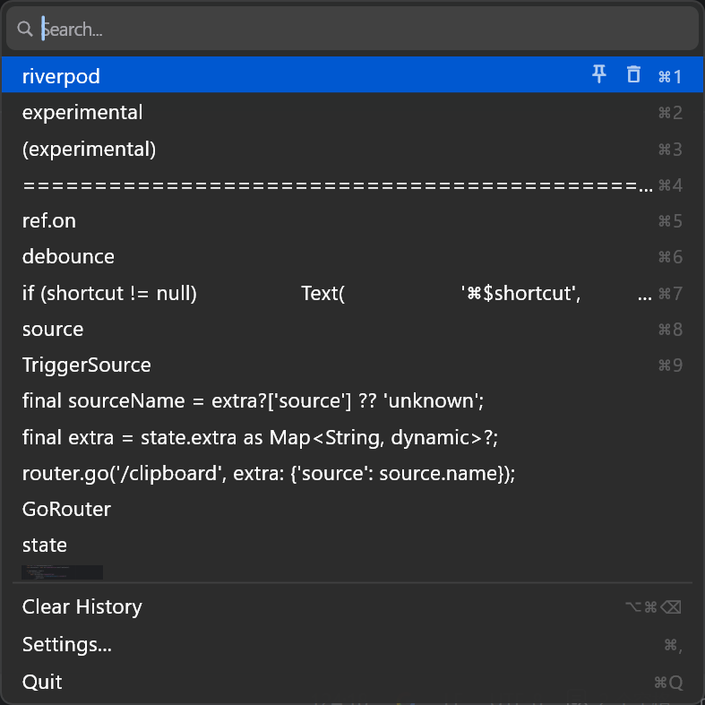
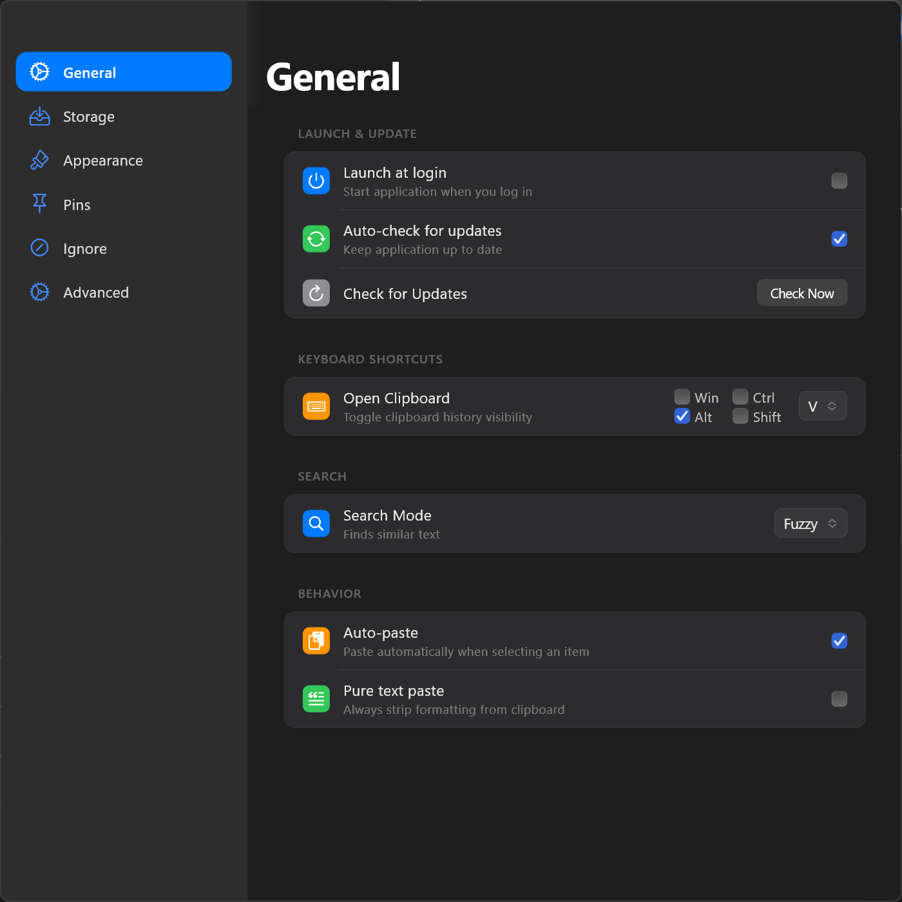
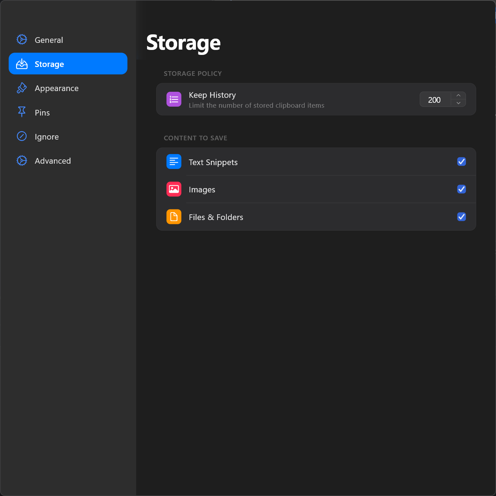
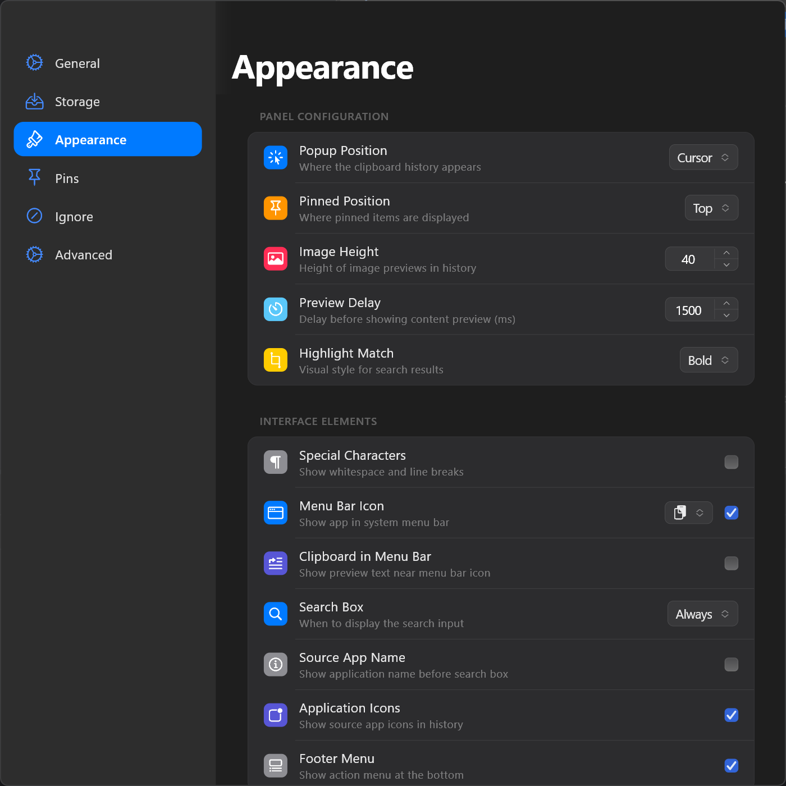

# HaliClip

HaliClip 是一款使用 Flutter 构建的轻量级、跨平台剪贴板管理助手。

> **注意**：当前项目仍在开发中，目前仅仅以 Windows 平台作为主要目标，因此 macOS 与 Linux 上可能会有些许问题。

## 立项动机

因为工作需要，我同时持有 Windows 和 macOS 设备。macOS 上的 Maccy 非常好用，极简高效的 UI 极大提升了我的生产力。反观 Windows 平台下的剪贴板工具，往往与“高效”毫不沾边。

此外，我经常需要在两台设备间无缝切换工作，常常需要在一端复制文本、图片或文件，然后在另一端使用。因此，我决定自己动手开发 HaliClip。

**此项目的目标就是仿照 Maccy 并且实现多端同步，后续会将前后端全部开源。**

**未来规划**：本项目后续还会添加云同步的功能，不仅仅同步文本，还将支持同步图片、文件等，彻底打通跨设备剪贴板流转的壁垒。

## 核心特性

- 多平台支持：目前支持运行于 Windows、macOS 和 Linux。
- 极简高效 UI：致敬 Maccy 的极简设计，提供纯粹、不打扰的剪贴板历史管理体验。
- 强大的搜索能力：支持精确匹配、模糊搜索、正则表达式以及混合搜索模式，快速定位历史记录。
- 富媒体剪贴板：不仅支持纯文本，还支持图片实时预览、文件和文件夹路径的保存。
- 极致快捷操作：
  - 全局热键一键唤醒
  - Alt + 数字键 快捷选择与自动粘贴
  - 支持历史记录置顶（Pin）与快捷删除
- 高度可定制：
  - 支持窗口跟随鼠标光标弹出或屏幕居中显示
  - 支持开机自启、系统托盘常驻
  - 丰富的主题（明/暗模式）与界面元素自定义选项
- 本地存储与隐私：基于 SQLite 的本地持久化，支持配置退出时自动清空历史及系统剪贴板，全面保护您的隐私。

## 界面预览

  

---

   
   
   

## 技术栈

- UI 框架: [Flutter](https://flutter.dev/)
- 状态管理: [Riverpod](https://riverpod.dev/)
- 本地数据库: [Drift](https://drift.simonbinder.eu/) (SQLite)
- 路由管理: [GoRouter](https://pub.dev/packages/go_router)

## 未来规划 (Roadmap)

- [ ] 跨设备云同步：支持多端设备间文本、图片、文件的剪贴板实时云端同步。
- [ ] 更多数据格式的深层解析与支持。
- [ ] 自定义应用黑名单与高级过滤规则。

## 许可证

本项目基于 [GPL-3.0 License](LICENSE) 协议开源。